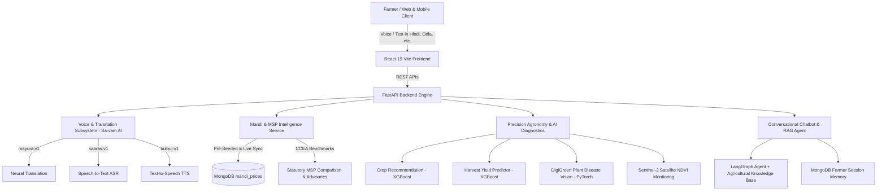

# KrishiVaani (कृषि वाणी / କୃଷି ବାଣୀ)
> **Empowering Indian Farmers with Intelligent Regional Voice AI, Live Mandi Spot vs. Statutory MSP Intelligence, Satellite Health Analytics, and Precision Crop Diagnostics.**

[](https://fastapi.tiangolo.com)
[](https://react.dev)
[](https://vitejs.dev)
[](https://www.mongodb.com)
[](https://www.sarvam.ai)
[](https://xgboost.readthedocs.io)
[](https://pytorch.org)
[](https://sentinel.esa.int)

---

## 🌾 Overview

**KrishiVaani** is a unified, multilingual, voice-first Agritech decision-support platform designed specifically for smallholder and marginal farmers across India. It bridges agricultural scientific research, real-time market data, satellite earth observation, and deep learning diagnostics into an accessible regional interface supporting major Indian languages.

---

## 🚀 Key Modules & Architecture



### 1. 🎙️ Native Indic Voice & Language Intelligence (Powered by Sarvam AI)
- Complete replacement of generic pipelines with **Sarvam AI's** Indic-first foundation models:
  - **Speech-to-Text (ASR)**: `saaras:v1` handles heavy regional accents and colloquial rural speech.
  - **Translation (NMT)**: `mayura:v1` translates complex agricultural advisories between English and 10+ Indic languages (Hindi, Odia, Bengali, Punjabi, Telugu, Tamil, Marathi, Gujarati, Kannada, Malayalam).
  - **Text-to-Speech (TTS)**: `bulbul:v1` produces natural, empathetic regional voice audio with natural Indian cadence.
- Fully resilient with automatic fallback to regional agro-dictionaries when working in offline or low-connectivity rural zones.

### 2. 📊 Live APMC Mandi Spot Prices vs. Statutory MSP Advisory (Alternative 1)
- **High-Performance MongoDB Cache (`mandi_prices`)**: Eliminates reliance on brittle external government scrapers or gated portals by serving pre-seeded, verified APMC spot prices across 13+ agricultural states (Punjab, Haryana, MP, UP, Rajasthan, Gujarat, Maharashtra, Odisha, West Bengal, Bihar, Andhra Pradesh, Telangana, Karnataka).
- **Statutory MSP Benchmarks**: Built-in statutory Minimum Support Prices set by the Cabinet Committee on Economic Affairs (CCEA) for Kharif and Rabi crops (Wheat: ₹2,275, Paddy: ₹2,300, Cotton: ₹7,121, Mustard: ₹5,650, Gram: ₹5,440, Soybean: ₹4,892, Maize: ₹2,090, etc.).
- **Smart Selling Advisory**:
  - **Above MSP (🟢)**: Alerts farmers to sell in open APMC mandis for maximum market margin.
  - **Below MSP (🔴)**: Directs farmers to nearby government procurement centers (FCI / state agencies) to ensure statutory floor price protection.
- Directly integrated into both the **Yield & Production Cost Calculator** and the **Conversational Chatbot Tools** (`get_market_price_tool`).

### 3. 🌱 AI Agronomy & Precision Farming
- **Crop Planning & Recommendation**: Evaluates soil N, P, K, pH, rainfall, temperature, and humidity using optimized XGBoost models.
- **Harvest Yield Prediction**: Estimates quintals per hectare based on district, state, crop season, and cultivated acreage.
- **DigiGreen Disease Diagnosis**: PyTorch computer vision model classifying crop leaf diseases (Healthy, Blight, Rust, Rot, Mosaic Virus) with instant chemical and bio-fungicide treatment advisories.
- **Sentinel-2 Satellite NDVI**: Ingests multispectral Earth observation bands (B4 Red & B8 NIR) to compute Normalized Difference Vegetation Index (NDVI), canopy moisture, and historical vigor curves.

### 4. 💬 Context-Aware Conversational Chatbot & RAG
- LangChain / LangGraph agent combining farmer historical profiles, soil test history, satellite vegetation data, and live Mandi prices.
- Persistent session memory stored per farmer in MongoDB with zero cold-start latency.

---

## 🛠️ Project Structure

```
KrishiVaani/
├── backend/
│   ├── app/
│   │   ├── core/                  # App settings, MongoDB connector, logging
│   │   ├── main.py                # FastAPI factory, lifespan, CORS, router mounting
│   │   └── services/
│   │       ├── chatbot_agent/     # LangGraph agent, agricultural tools, memory
│   │       ├── crop_planning/     # Crop rotation and seasonal planning engine
│   │       ├── crop_recommendation/# XGBoost soil suitability engine
│   │       ├── disease_detection/ # PyTorch plant pathology vision model
│   │       ├── farmer_profile/    # Farmer records, soil test logs, farm history
│   │       ├── mandi_service/     # Alternative 1 Mandi store, MSP advisory, API router
│   │       ├── production_cost/   # Production cost and profit analysis
│   │       ├── rag_service/       # Vector store & agricultural extension RAG
│   │       ├── satellite_service/ # Sentinel-2 satellite NDVI ingestion
│   │       ├── voice_language_service/ # Sarvam AI translation, ASR & TTS client
│   │       ├── weather_service/   # Agrometeorological forecasts & alerts
│   │       └── yield_prediction/  # XGBoost harvest yield model
│   └── tests/                     # 54+ comprehensive pytest test suites
├── frontend/
│   ├── src/
│   │   ├── components/            # UI components (YieldCalculator, ChatbotWidget, etc.)
│   │   ├── services/              # Axios API clients
│   │   ├── App.jsx                # Main application dashboard
│   │   └── index.css              # Custom Tailwind CSS styling
│   └── package.json               # React 19, Lucide, Tailwind, Vite configuration
├── Readme.md                      # Comprehensive project documentation
└── requirements.txt               # Backend Python dependencies
```

---

## ⚙️ Quickstart & Local Setup

### Prerequisites
- **Python**: 3.11+ (Tested and verified on Python 3.13)
- **Node.js**: v18+ or v20+
- **MongoDB**: MongoDB Atlas URI or local instance on `mongodb://localhost:27017`

### 1. Backend Configuration
Create or update `backend/.env`:
```env
APP_NAME=KrishiVaani
ENVIRONMENT=development
PORT=8000

# MongoDB Configuration
MONGODB_URI=mongodb://localhost:27017/krishivaani
MONGODB_DB_NAME=krishivaani

# Sarvam AI Indic Voice Configuration
SARVAM_API_KEY=your_sarvam_api_key_here
SARVAM_BASE_URL=https://api.sarvam.ai

# Weather & Open-Meteo
OPEN_METEO_API_URL=https://api.open-meteo.com/v1/forecast
```

### 2. Start Backend Server
```bash
# In the root repository directory
.\.venv\Scripts\activate
uvicorn backend.app.main:app --reload --port 8000
```
Swagger UI will be available at: `http://localhost:8000/docs`

### 3. Start Frontend Dashboard
```bash
cd frontend
npm install
npm run dev
```
Access the application dashboard at: `http://localhost:5173`

---

## 🧪 Testing & Verification

Run the complete backend test suite:
```bash
py -3.13 -m pytest backend/tests/ -v
```
All 54 test suites validate:
- Sarvam AI language translation (`mayura:v1`), speech-to-text (`saaras:v1`), and speech synthesis (`bulbul:v1`).
- APMC Mandi price caching, commodity alias normalization, and statutory MSP advisory comparisons.
- Machine learning engines (XGBoost crop recommendation & yield predictions).
- PyTorch disease classification pipeline.
- Farmer profile persistence, soil test history, and session memory.

Build the frontend bundle:
```bash
cd frontend
npm run build
```

---

## 📜 License
Distributed under the MIT License. Built for Indian Agriculture.